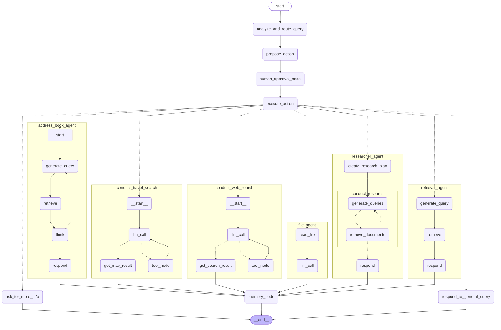

## 说明
# 基于LangGraph的通用对话多智能体


# 项目结构
- `src/`：项目的源代码目录
  - `superviser_graph/`：主图Superviser相关代码
  - `index_graph/`：用于基于字符串序列构建RAG索引相关代码
  - `retrieval_graph/`：检索langchain知识的RAG检索相关代码
  - `file_agent/`：用户给定输入文件（docx、pdf、text）问题图相关代码
  - `address_book_agent/`：地址簿excel问题图相关代码
  - `web_search_agent/`：网络搜索问题图相关代码
  - `travel_agent/`：基于百度地图MCP的旅行规划agent
  - `langchain_agent/`：Langchain实例的RAG问题图相关代码
  - `researcher_agent/`：Langgraph实例的RAG问题深入研究相关代码
  - `shared/`：共享代码，包括工具函数、模型加载等
  - `dev_function.py`：开发用的函数，用于测试和调试
- `certs/`：用于连接elastic的证书信息
- `tests/`：典型的测试用例，目前未覆盖所有测试
- `README.md`：项目的说明文档

# 主要功能
- 支持用户输入问题并生成响应
- 支持不同类型的问题，如基于excel的地址簿检索问题、基于文件问答问题、基于Web搜索的问答问题、基于MCP的旅行规划问题、基于RAG的langchain问答问、基于RAG的研究报告生成问题等
- 支持基于LangGraph的workflow、React Agent、Router构建的superviser多智能体架构

# 系统架构图

以下是superviser_agent的流程图，展示了整个系统的架构和各组件之间的关系：



# 运行测试
```
python dev_function.py
```

# 贡献
欢迎提交Pull Request来改进项目。请确保在提交前运行测试并更新文档。

# 许可证
本项目基于MIT许可证开源。
